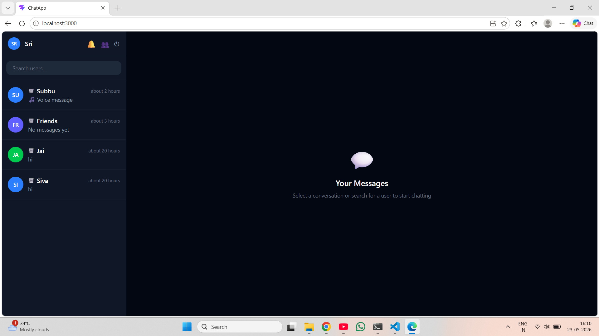
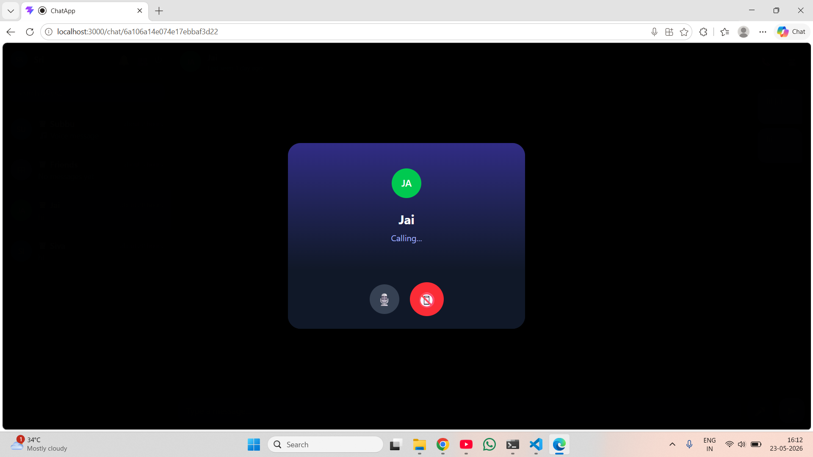
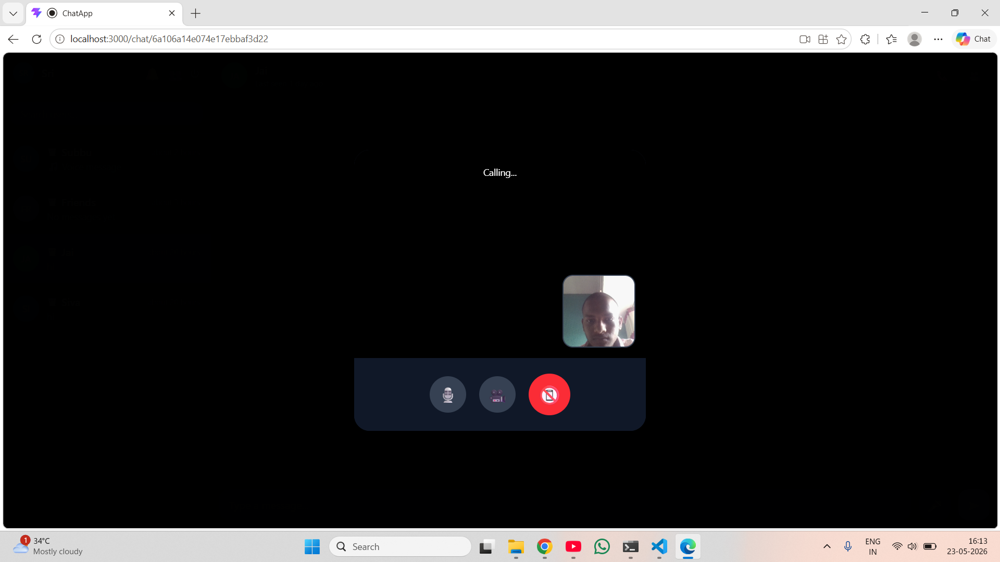
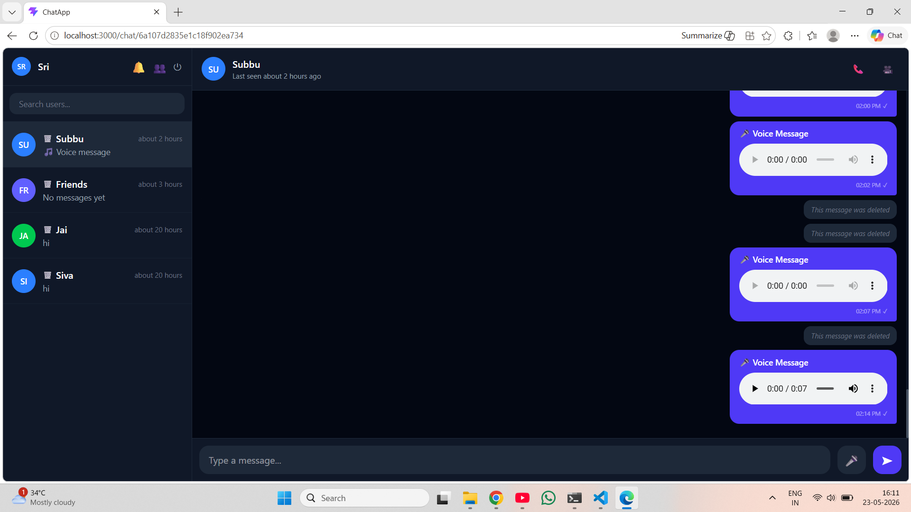
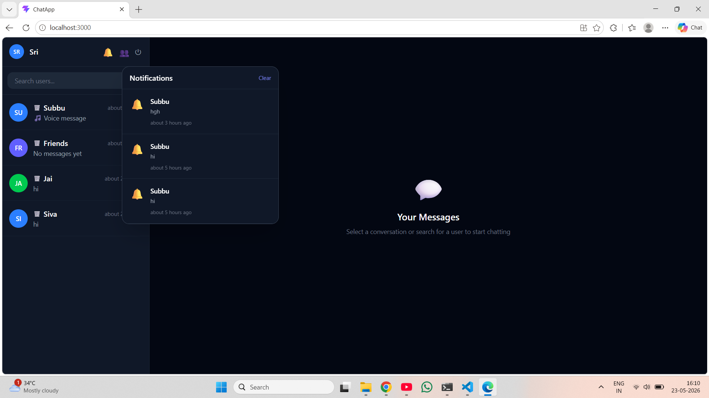

# ChatApp — Production Real-Time Chat Application

A full-stack real-time chat application built with React, Node.js, Socket.IO, MongoDB, and Redis.

## Features

- Real-time messaging with Socket.IO
- One-on-one and group chats
- Typing indicators & read receipts
- Message reactions, edit, delete
- Media uploads (images, video, audio, files) via Cloudinary
- Voice messages
- Online/offline status & last seen
- JWT authentication
- Push notifications (browser + in-app)
- PWA — installable on mobile/desktop
- Dark mode UI
- Infinite scroll message history
- Docker support

## Tech Stack

| Layer | Technology |
|---|---|
| Frontend | React 19, Vite, Tailwind CSS v4, Zustand, Socket.IO Client |
| Backend | Node.js, Express.js, Socket.IO, JWT, bcryptjs |
| Database | MongoDB + Mongoose |
| Cache | Redis (ioredis) |
| Media | Cloudinary + Multer |
| Deployment | Vercel (frontend) + Render (backend) + MongoDB Atlas |

## Project Structure

```
Realtime-Chat-App/
├── client/          # React frontend
│   ├── src/
│   │   ├── components/   # Reusable UI components
│   │   ├── pages/        # Route-level pages
│   │   ├── store/        # Zustand state stores
│   │   ├── hooks/        # Custom React hooks
│   │   ├── services/     # Axios API layer
│   │   └── sockets/      # Socket.IO client
│   └── public/           # Static assets + PWA files
└── server/          # Node.js backend
    ├── controllers/  # Route handlers
    ├── models/       # Mongoose schemas
    ├── routes/       # Express routers
    ├── middleware/   # Auth, error, rate limiting
    ├── sockets/      # Socket.IO event handlers
    ├── services/     # Business logic (upload, etc.)
    └── config/       # DB, Redis, Cloudinary, Multer
```

## Local Development

### Prerequisites
- Node.js 20+
- MongoDB (local or Atlas)
- Redis (local or cloud)
- Cloudinary account

### Setup

1. Clone the repo
2. Setup backend:
```bash
cd server
cp .env.example .env   # Fill in your values
npm install
npm start
```

3. Setup frontend:
```bash
cd client
cp .env.example .env
npm install
npm run dev
```

4. Open http://localhost:5173

### Docker (all-in-one)

```bash
cp .env.example .env   # Fill in Cloudinary + JWT values
docker-compose up --build
```

Open http://localhost

## Deployment

### Frontend → Vercel
1. Push to GitHub
2. Import repo in Vercel
3. Set `VITE_API_URL` and `VITE_SOCKET_URL` env vars
4. Deploy

### Backend → Render
1. Connect GitHub repo
2. Set root directory to `server/`
3. Add all env vars from `render.yaml`
4. Deploy

### Database → MongoDB Atlas
1. Create free cluster at mongodb.com/atlas
2. Whitelist `0.0.0.0/0` for Render
3. Copy connection string to `MONGO_URI`

# Screenshots

## Home Page



---

## Audio Call



---

## Video Call



---

## Voice Message



---

## Notifications



## API Endpoints

| Method | Endpoint | Description |
|---|---|---|
| POST | /api/auth/register | Register |
| POST | /api/auth/login | Login |
| GET | /api/auth/me | Get current user |
| GET | /api/users/search?q= | Search users |
| PUT | /api/users/profile | Update profile |
| GET | /api/chats | Get my chats |
| POST | /api/chats/direct | Get/create DM |
| POST | /api/chats/group | Create group |
| GET | /api/messages/:chatId | Get messages |
| POST | /api/messages | Send message |
| PUT | /api/messages/:id | Edit message |
| DELETE | /api/messages/:id | Delete message |
| GET | /api/notifications | Get notifications |

## Socket.IO Events

| Event | Direction | Description |
|---|---|---|
| message:send | Client → Server | Send a message |
| message:new | Server → Client | New message received |
| message:edit | Client → Server | Edit a message |
| message:delete | Client → Server | Delete a message |
| message:react | Client → Server | React to message |
| message:read | Client → Server | Mark messages as read |
| typing:start/stop | Bidirectional | Typing indicator |
| user:online/offline | Server → Client | Online status |
| group:add_member | Client → Server | Add group member |
| group:remove_member | Client → Server | Remove group member |
| group:updated | Server → Client | Group info changed |
| notification:message | Server → Client | New message notification |
